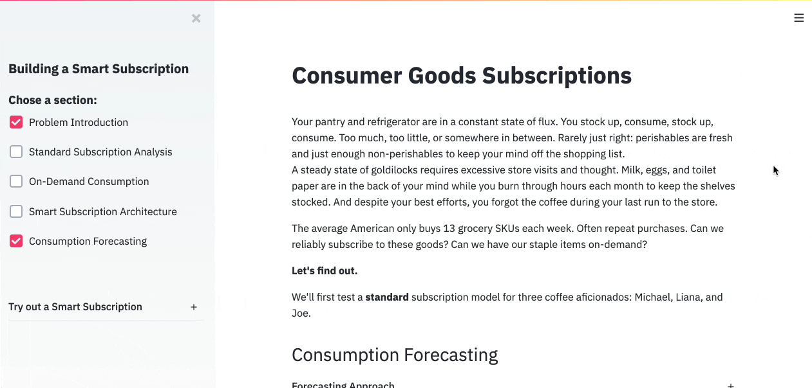

# smart-simulation



Use this tool learn about weight based smart subscriptions for consumer goods.
[Launch the app!](https://share.streamlit.io/jbpauly/smart-simulation/main.py)

[Bottomless](https://www.bottomless.com/) is the first of its kind smart subscription provider.
The company provides continuous, just-in-time, delivery of premium coffee from top roaster across the country.

To achieve just-in-time delivery,
Bottomless provides subscribers a wifi connected kitchen scale, monitors their consumption,
and sends off the next order before the customer's local stock runs out.
The consumption, as a way of weight, data is the critical component used to balance supply and demand.

Data and machine learning is at the core of smart subscriptions,
and there are multiple agents or factors involved with
smart subscriptions: *Customers, Scales, Product Marketplace,
Warehouses, Shipping*.

## Simulate smart subscriptions for yourself by following the steps below

This package generates simulated desired smart subscription data:
1. customer's desired consumption
2. scale weight measurements

## Dependencies
Python >= 3.7

## Run Locally in Virtual Environment

Documentation example uses `bash commands` and works for Mac and Linux
OS.

### Clone Repository to Local Directory

Detailed instructions on cloning:
<https://docs.github.com/en/github/creating-cloning-and-archiving-repositories/cloning-a-repository>

`git clone https://github.com/jbpauly/smart-simulation.git`

### Move to The Project Directory

`cd smart-simulation`

### Create the Virtual Environment

`python -m venv venv`

### Activate the Virtual Environment

`source venv/bin/activate`

### Install Requirements

`pip install -r requirements.txt`

### Install the Package

`pip install -e .`

### Run the Package Locally

**Explore CLI Options**

`smart_simulation --help`

`smart_simulation create-consumption --help` :

Usage: smart_simulation batch-simulation [OPTIONS]

```
Usage: smart_simulation batch-simulation [OPTIONS]

  Create a batch of consumer servings and scale weight data generation and
  save to an simulation output directory.
  Args:
        number_instances: Number of instances to simulate with the configuration selections.
        customer_template: Configuration choice for customer template.
        upsample_template: Configuration choice for upsample template.
        delivery_days_template: Configuration choice for delivery days template.
        delivery_skew_template: Configuration choice for delivery skew template.
        weight_template: Configuration choice for weight template.
        quantity_weight_template: Configuration choice for quantity to weight template.
        start_date: Start date of the data generation in YYYY-MM-DD format.
        num_days: Number of days to generate data.
        output_path: Output path for the simulations directory and generated data csv files.

Options:
  -n, --number_instances INTEGER
  -c, --customer_template [Michael|Joe|Liana]
  -u, --upsample_template [Standard]
  -dd, --delivery_days_template [Standard]
  -ds, --delivery_skew_template [skew_early|skew_on_time|skew_late|perfect]
  -w, --weight_template [Standard]
  -qw, --quantity_weight_template [Standard]
  -s, --start_date TEXT
  -d, --num_days INTEGER
  -p, --output_path PATH
  --help                          Show this message and exit.

```

### Example Use

`smart_simulation batch-simulation`

**Check output path for simulations directory**

```
simulations
│   simulations_log.csv
│
└───servings
│   │   01_daily.csv
│   │   01_upsampled.csv
│   │   ...
│
└───weight
    │   01_arrival.csv
    │   ...
```


Credits
-------

This package was created with
[Cookiecutter](https://github.com/audreyr/cookiecutter) and the
[audreyr/cookiecutter-pypackage](https://github.com/audreyr/cookiecutter-pypackage)
project template.
